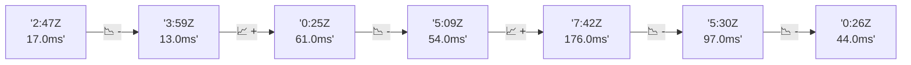

# 📊 Reporte de Performance - PokeAPI

**Fecha de corrida:** 2026-09-12 15:56 UTC

**Enlace:** [34703590949](https://github.com/rba3/Lab_CD_CI_Perfomance/actions/runs/34703590949)

## ✅ Veredicto

```
PASS (fallback por umbrales)

- Error maximo: 0.0%
- p95 maximo: 54.4 ms
```

## 🔮 Predicciones

✓ STABLE

## 📈 Métricas Globales

| Métrica | Valor | SLO | Estado |
|---------|-------|-----|--------|
| Error Rate | 0.0% | < 0.1% | ✅ PASS |
| Latencia p50 | 22.0ms | - | ℹ️ |
| Latencia p95 | 37.0ms | < 800ms | ✅ PASS |
| Latencia p99 | 54.0ms | - | ℹ️ |
| Throughput | 0.00 req/s | - | ℹ️ |
| Muestras | 0 | - | ℹ️ |

## 📉 Tendencia Histórica (Últimas 7 corridas)



## 🔧 Análisis Técnico Detallado (JSON)

```json
{
  "predictions": {
    "prediction": "STABLE",
    "confidence": 0,
    "slope_ms_per_run": -4.25,
    "current_p95": 37.0,
    "days_to_warn": null,
    "days_to_fail": null,
    "risk_level": "LOW"
  },
  "recommendations": [],
  "correlations": {},
  "root_cause": {
    "issue": null,
    "root_cause": null,
    "confidence": 0,
    "evidence": []
  },
  "timestamp": "2026-09-12T15:56:21.382894"
}
```

## 📦 Datos Completos (JSON)

```json
{
  "scenario": "load",
  "overall": {
    "samples": 16238,
    "errors": 0,
    "error_pct": 0.0,
    "avg_ms": 23.7,
    "min_ms": 14,
    "max_ms": 219,
    "p50_ms": 22.0,
    "p90_ms": 31.0,
    "p95_ms": 37.0,
    "p99_ms": 54.0,
    "throughput_rps": 135.74,
    "duration_s": 119.6
  },
  "by_endpoint": {
    "ability-static": {
      "samples": 1623,
      "errors": 0,
      "error_pct": 0.0,
      "avg_ms": 23.1,
      "min_ms": 14,
      "max_ms": 110,
      "p50_ms": 21.0,
      "p90_ms": 30.0,
      "p95_ms": 35.0,
      "p99_ms": 49.0,
      "throughput_rps": 13.71,
      "duration_s": 118.3
    },
    "berry-cheri": {
      "samples": 1623,
      "errors": 0,
      "error_pct": 0.0,
      "avg_ms": 25.3,
      "min_ms": 14,
      "max_ms": 110,
      "p50_ms": 23.0,
      "p90_ms": 35.0,
      "p95_ms": 41.0,
      "p99_ms": 60.6,
      "throughput_rps": 13.72,
      "duration_s": 118.3
    },
    "generation-1": {
      "samples": 1624,
      "errors": 0,
      "error_pct": 0.0,
      "avg_ms": 22.4,
      "min_ms": 14,
      "max_ms": 111,
      "p50_ms": 21.0,
      "p90_ms": 29.0,
      "p95_ms": 34.0,
      "p99_ms": 47.0,
      "throughput_rps": 13.75,
      "duration_s": 118.1
    },
    "move-tackle": {
      "samples": 1624,
      "errors": 0,
      "error_pct": 0.0,
      "avg_ms": 22.9,
      "min_ms": 15,
      "max_ms": 97,
      "p50_ms": 21.0,
      "p90_ms": 30.0,
      "p95_ms": 34.0,
      "p99_ms": 47.8,
      "throughput_rps": 13.75,
      "duration_s": 118.1
    },
    "pokemon-charizard": {
      "samples": 1624,
      "errors": 0,
      "error_pct": 0.0,
      "avg_ms": 27.1,
      "min_ms": 17,
      "max_ms": 128,
      "p50_ms": 25.0,
      "p90_ms": 35.0,
      "p95_ms": 42.0,
      "p99_ms": 66.8,
      "throughput_rps": 13.64,
      "duration_s": 119.1
    },
    "pokemon-ditto": {
      "samples": 1624,
      "errors": 0,
      "error_pct": 0.0,
      "avg_ms": 22.9,
      "min_ms": 14,
      "max_ms": 219,
      "p50_ms": 21.0,
      "p90_ms": 30.0,
      "p95_ms": 36.0,
      "p99_ms": 53.0,
      "throughput_rps": 13.58,
      "duration_s": 119.6
    },
    "pokemon-list": {
      "samples": 1624,
      "errors": 0,
      "error_pct": 0.0,
      "avg_ms": 21.1,
      "min_ms": 14,
      "max_ms": 117,
      "p50_ms": 20.0,
      "p90_ms": 27.0,
      "p95_ms": 31.8,
      "p99_ms": 48.0,
      "throughput_rps": 13.68,
      "duration_s": 118.7
    },
    "pokemon-pikachu": {
      "samples": 1624,
      "errors": 0,
      "error_pct": 0.0,
      "avg_ms": 26.2,
      "min_ms": 17,
      "max_ms": 131,
      "p50_ms": 24.0,
      "p90_ms": 35.0,
      "p95_ms": 41.0,
      "p99_ms": 55.8,
      "throughput_rps": 13.64,
      "duration_s": 119.1
    },
    "type-fire": {
      "samples": 1624,
      "errors": 0,
      "error_pct": 0.0,
      "avg_ms": 22.7,
      "min_ms": 14,
      "max_ms": 94,
      "p50_ms": 21.0,
      "p90_ms": 30.0,
      "p95_ms": 36.0,
      "p99_ms": 52.0,
      "throughput_rps": 13.71,
      "duration_s": 118.5
    },
    "type-water": {
      "samples": 1624,
      "errors": 0,
      "error_pct": 0.0,
      "avg_ms": 22.7,
      "min_ms": 14,
      "max_ms": 107,
      "p50_ms": 21.0,
      "p90_ms": 29.0,
      "p95_ms": 34.0,
      "p99_ms": 48.0,
      "throughput_rps": 13.69,
      "duration_s": 118.7
    }
  },
  "empty": false
}
```

---

*Reporte generado automáticamente por el workflow de performance.*

*Timestamp: 2026-09-12T15:56:21.383977Z*
