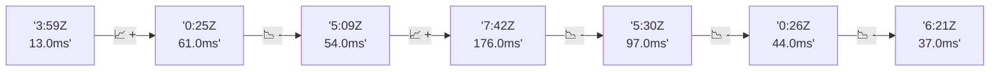

# 📊 Reporte de Performance - PokeAPI

**Fecha de corrida:** 2026-09-13 16:43 UTC

**Enlace:** [34769310216](https://github.com/rba3/Lab_CD_CI_Perfomance/actions/runs/34769310216)

## ✅ Veredicto

```
PASS (fallback por umbrales)

- Error maximo: 0.0%
- p95 maximo: 41.2 ms
```

## 🔮 Predicciones

✓ STABLE

## 📈 Métricas Globales

| Métrica | Valor | SLO | Estado |
|---------|-------|-----|--------|
| Error Rate | 0.0% | < 0.1% | ✅ PASS |
| Latencia p50 | 20.0ms | - | ℹ️ |
| Latencia p95 | 32.0ms | < 800ms | ✅ PASS |
| Latencia p99 | 53.0ms | - | ℹ️ |
| Throughput | 0.00 req/s | - | ℹ️ |
| Muestras | 0 | - | ℹ️ |

## 📉 Tendencia Histórica (Últimas 7 corridas)



## 🔧 Análisis Técnico Detallado (JSON)

```json
{
  "predictions": {
    "prediction": "STABLE",
    "confidence": 0,
    "slope_ms_per_run": -4.25,
    "current_p95": 32.0,
    "days_to_warn": null,
    "days_to_fail": null,
    "risk_level": "LOW"
  },
  "recommendations": [],
  "correlations": {},
  "root_cause": {
    "issue": null,
    "root_cause": null,
    "confidence": 0,
    "evidence": []
  },
  "timestamp": "2026-09-13T16:43:39.688290"
}
```

## 📦 Datos Completos (JSON)

```json
{
  "scenario": "load",
  "overall": {
    "samples": 16324,
    "errors": 0,
    "error_pct": 0.0,
    "avg_ms": 21.7,
    "min_ms": 13,
    "max_ms": 362,
    "p50_ms": 20.0,
    "p90_ms": 27.0,
    "p95_ms": 32.0,
    "p99_ms": 53.0,
    "throughput_rps": 136.49,
    "duration_s": 119.6
  },
  "by_endpoint": {
    "ability-static": {
      "samples": 1632,
      "errors": 0,
      "error_pct": 0.0,
      "avg_ms": 21.1,
      "min_ms": 14,
      "max_ms": 122,
      "p50_ms": 19.0,
      "p90_ms": 26.0,
      "p95_ms": 31.4,
      "p99_ms": 48.7,
      "throughput_rps": 13.8,
      "duration_s": 118.3
    },
    "berry-cheri": {
      "samples": 1633,
      "errors": 0,
      "error_pct": 0.0,
      "avg_ms": 20.8,
      "min_ms": 14,
      "max_ms": 130,
      "p50_ms": 19.0,
      "p90_ms": 26.0,
      "p95_ms": 30.0,
      "p99_ms": 48.0,
      "throughput_rps": 13.8,
      "duration_s": 118.4
    },
    "generation-1": {
      "samples": 1632,
      "errors": 0,
      "error_pct": 0.0,
      "avg_ms": 20.7,
      "min_ms": 14,
      "max_ms": 99,
      "p50_ms": 19.0,
      "p90_ms": 26.0,
      "p95_ms": 31.0,
      "p99_ms": 47.7,
      "throughput_rps": 13.83,
      "duration_s": 118.0
    },
    "move-tackle": {
      "samples": 1632,
      "errors": 0,
      "error_pct": 0.0,
      "avg_ms": 22.3,
      "min_ms": 15,
      "max_ms": 238,
      "p50_ms": 20.0,
      "p90_ms": 27.0,
      "p95_ms": 36.0,
      "p99_ms": 65.0,
      "throughput_rps": 13.83,
      "duration_s": 118.0
    },
    "pokemon-charizard": {
      "samples": 1633,
      "errors": 0,
      "error_pct": 0.0,
      "avg_ms": 25.6,
      "min_ms": 18,
      "max_ms": 277,
      "p50_ms": 23.0,
      "p90_ms": 30.8,
      "p95_ms": 38.0,
      "p99_ms": 67.1,
      "throughput_rps": 13.72,
      "duration_s": 119.0
    },
    "pokemon-ditto": {
      "samples": 1633,
      "errors": 0,
      "error_pct": 0.0,
      "avg_ms": 21.2,
      "min_ms": 15,
      "max_ms": 247,
      "p50_ms": 19.0,
      "p90_ms": 26.0,
      "p95_ms": 31.4,
      "p99_ms": 50.4,
      "throughput_rps": 13.66,
      "duration_s": 119.6
    },
    "pokemon-list": {
      "samples": 1632,
      "errors": 0,
      "error_pct": 0.0,
      "avg_ms": 19.2,
      "min_ms": 14,
      "max_ms": 97,
      "p50_ms": 18.0,
      "p90_ms": 24.0,
      "p95_ms": 27.0,
      "p99_ms": 41.0,
      "throughput_rps": 13.76,
      "duration_s": 118.6
    },
    "pokemon-pikachu": {
      "samples": 1633,
      "errors": 0,
      "error_pct": 0.0,
      "avg_ms": 24.5,
      "min_ms": 17,
      "max_ms": 263,
      "p50_ms": 22.0,
      "p90_ms": 29.0,
      "p95_ms": 36.0,
      "p99_ms": 70.7,
      "throughput_rps": 13.71,
      "duration_s": 119.1
    },
    "type-fire": {
      "samples": 1632,
      "errors": 0,
      "error_pct": 0.0,
      "avg_ms": 20.8,
      "min_ms": 13,
      "max_ms": 144,
      "p50_ms": 19.0,
      "p90_ms": 26.0,
      "p95_ms": 30.4,
      "p99_ms": 46.0,
      "throughput_rps": 13.78,
      "duration_s": 118.4
    },
    "type-water": {
      "samples": 1632,
      "errors": 0,
      "error_pct": 0.0,
      "avg_ms": 21.0,
      "min_ms": 14,
      "max_ms": 362,
      "p50_ms": 19.0,
      "p90_ms": 26.0,
      "p95_ms": 30.0,
      "p99_ms": 47.0,
      "throughput_rps": 13.76,
      "duration_s": 118.6
    }
  },
  "empty": false
}
```

---

*Reporte generado automáticamente por el workflow de performance.*

*Timestamp: 2026-09-13T16:43:39.689723Z*
