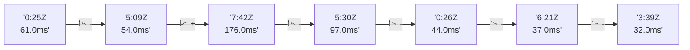

# 📊 Reporte de Performance - PokeAPI

**Fecha de corrida:** 2026-09-14 18:16 UTC

**Enlace:** [34879486506](https://github.com/rba3/Lab_CD_CI_Perfomance/actions/runs/34879486506)

## ✅ Veredicto

```
PASS (fallback por umbrales)

- Error maximo: 0.0%
- p95 maximo: 60.6 ms
```

## 🔮 Predicciones

✓ STABLE

## 📈 Métricas Globales

| Métrica | Valor | SLO | Estado |
|---------|-------|-----|--------|
| Error Rate | 0.0% | < 0.1% | ✅ PASS |
| Latencia p50 | 30.0ms | - | ℹ️ |
| Latencia p95 | 48.0ms | < 800ms | ✅ PASS |
| Latencia p99 | 72.0ms | - | ℹ️ |
| Throughput | 0.00 req/s | - | ℹ️ |
| Muestras | 0 | - | ℹ️ |

## 📉 Tendencia Histórica (Últimas 7 corridas)



## 🔧 Análisis Técnico Detallado (JSON)

```json
{
  "predictions": {
    "prediction": "STABLE",
    "confidence": 0,
    "slope_ms_per_run": -36.0,
    "current_p95": 48.0,
    "days_to_warn": null,
    "days_to_fail": null,
    "risk_level": "LOW"
  },
  "recommendations": [],
  "correlations": {},
  "root_cause": {
    "issue": null,
    "root_cause": null,
    "confidence": 0,
    "evidence": []
  },
  "timestamp": "2026-09-14T18:16:24.596295"
}
```

## 📦 Datos Completos (JSON)

```json
{
  "scenario": "load",
  "overall": {
    "samples": 15757,
    "errors": 0,
    "error_pct": 0.0,
    "avg_ms": 33.6,
    "min_ms": 15,
    "max_ms": 493,
    "p50_ms": 30.0,
    "p90_ms": 44.0,
    "p95_ms": 48.0,
    "p99_ms": 72.0,
    "throughput_rps": 131.64,
    "duration_s": 119.7
  },
  "by_endpoint": {
    "ability-static": {
      "samples": 1575,
      "errors": 0,
      "error_pct": 0.0,
      "avg_ms": 31.8,
      "min_ms": 16,
      "max_ms": 178,
      "p50_ms": 29.0,
      "p90_ms": 43.0,
      "p95_ms": 45.0,
      "p99_ms": 54.5,
      "throughput_rps": 13.3,
      "duration_s": 118.4
    },
    "berry-cheri": {
      "samples": 1575,
      "errors": 0,
      "error_pct": 0.0,
      "avg_ms": 31.3,
      "min_ms": 16,
      "max_ms": 224,
      "p50_ms": 28.0,
      "p90_ms": 43.0,
      "p95_ms": 45.0,
      "p99_ms": 51.0,
      "throughput_rps": 13.32,
      "duration_s": 118.3
    },
    "generation-1": {
      "samples": 1576,
      "errors": 0,
      "error_pct": 0.0,
      "avg_ms": 33.0,
      "min_ms": 16,
      "max_ms": 356,
      "p50_ms": 29.0,
      "p90_ms": 44.0,
      "p95_ms": 45.0,
      "p99_ms": 61.8,
      "throughput_rps": 13.34,
      "duration_s": 118.1
    },
    "move-tackle": {
      "samples": 1576,
      "errors": 0,
      "error_pct": 0.0,
      "avg_ms": 33.1,
      "min_ms": 16,
      "max_ms": 175,
      "p50_ms": 29.0,
      "p90_ms": 45.0,
      "p95_ms": 47.0,
      "p99_ms": 62.5,
      "throughput_rps": 13.34,
      "duration_s": 118.2
    },
    "pokemon-charizard": {
      "samples": 1576,
      "errors": 0,
      "error_pct": 0.0,
      "avg_ms": 41.5,
      "min_ms": 20,
      "max_ms": 384,
      "p50_ms": 36.0,
      "p90_ms": 58.0,
      "p95_ms": 64.0,
      "p99_ms": 133.2,
      "throughput_rps": 13.23,
      "duration_s": 119.1
    },
    "pokemon-ditto": {
      "samples": 1577,
      "errors": 0,
      "error_pct": 0.0,
      "avg_ms": 32.8,
      "min_ms": 16,
      "max_ms": 230,
      "p50_ms": 29.0,
      "p90_ms": 44.0,
      "p95_ms": 47.0,
      "p99_ms": 71.0,
      "throughput_rps": 13.18,
      "duration_s": 119.7
    },
    "pokemon-list": {
      "samples": 1575,
      "errors": 0,
      "error_pct": 0.0,
      "avg_ms": 29.7,
      "min_ms": 15,
      "max_ms": 378,
      "p50_ms": 27.0,
      "p90_ms": 40.0,
      "p95_ms": 43.0,
      "p99_ms": 60.8,
      "throughput_rps": 13.27,
      "duration_s": 118.7
    },
    "pokemon-pikachu": {
      "samples": 1576,
      "errors": 0,
      "error_pct": 0.0,
      "avg_ms": 37.8,
      "min_ms": 19,
      "max_ms": 312,
      "p50_ms": 33.0,
      "p90_ms": 55.0,
      "p95_ms": 58.0,
      "p99_ms": 114.0,
      "throughput_rps": 13.23,
      "duration_s": 119.1
    },
    "type-fire": {
      "samples": 1576,
      "errors": 0,
      "error_pct": 0.0,
      "avg_ms": 31.3,
      "min_ms": 15,
      "max_ms": 493,
      "p50_ms": 29.0,
      "p90_ms": 42.0,
      "p95_ms": 45.0,
      "p99_ms": 53.2,
      "throughput_rps": 13.3,
      "duration_s": 118.5
    },
    "type-water": {
      "samples": 1575,
      "errors": 0,
      "error_pct": 0.0,
      "avg_ms": 33.7,
      "min_ms": 17,
      "max_ms": 304,
      "p50_ms": 31.0,
      "p90_ms": 43.0,
      "p95_ms": 47.0,
      "p99_ms": 62.5,
      "throughput_rps": 13.28,
      "duration_s": 118.6
    }
  },
  "empty": false
}
```

---

*Reporte generado automáticamente por el workflow de performance.*

*Timestamp: 2026-09-14T18:16:24.597380Z*
