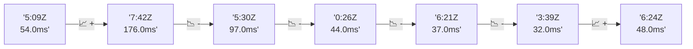

# 📊 Reporte de Performance - PokeAPI

**Fecha de corrida:** 2026-09-15 17:22 UTC

**Enlace:** [35000581759](https://github.com/rba3/Lab_CD_CI_Perfomance/actions/runs/35000581759)

## ✅ Veredicto

```
PASS (fallback por umbrales)

- Error maximo: 0.0%
- p95 maximo: 68.6 ms
```

## 🔮 Predicciones

✓ STABLE

## 📈 Métricas Globales

| Métrica | Valor | SLO | Estado |
|---------|-------|-----|--------|
| Error Rate | 0.0% | < 0.1% | ✅ PASS |
| Latencia p50 | 19.0ms | - | ℹ️ |
| Latencia p95 | 47.0ms | < 800ms | ✅ PASS |
| Latencia p99 | 64.8ms | - | ℹ️ |
| Throughput | 0.00 req/s | - | ℹ️ |
| Muestras | 0 | - | ℹ️ |

## 📉 Tendencia Histórica (Últimas 7 corridas)



## 🔧 Análisis Técnico Detallado (JSON)

```json
{
  "predictions": {
    "prediction": "STABLE",
    "confidence": 0,
    "slope_ms_per_run": -12.25,
    "current_p95": 47.0,
    "days_to_warn": null,
    "days_to_fail": null,
    "risk_level": "LOW"
  },
  "recommendations": [],
  "correlations": {},
  "root_cause": {
    "issue": null,
    "root_cause": null,
    "confidence": 0,
    "evidence": []
  },
  "timestamp": "2026-09-15T17:22:38.417268"
}
```

## 📦 Datos Completos (JSON)

```json
{
  "scenario": "load",
  "overall": {
    "samples": 16217,
    "errors": 0,
    "error_pct": 0.0,
    "avg_ms": 24.0,
    "min_ms": 6,
    "max_ms": 1012,
    "p50_ms": 19.0,
    "p90_ms": 41.0,
    "p95_ms": 47.0,
    "p99_ms": 64.8,
    "throughput_rps": 135.59,
    "duration_s": 119.6
  },
  "by_endpoint": {
    "ability-static": {
      "samples": 1621,
      "errors": 0,
      "error_pct": 0.0,
      "avg_ms": 23.0,
      "min_ms": 6,
      "max_ms": 107,
      "p50_ms": 19.0,
      "p90_ms": 40.0,
      "p95_ms": 44.0,
      "p99_ms": 52.8,
      "throughput_rps": 13.7,
      "duration_s": 118.4
    },
    "berry-cheri": {
      "samples": 1622,
      "errors": 0,
      "error_pct": 0.0,
      "avg_ms": 22.8,
      "min_ms": 6,
      "max_ms": 292,
      "p50_ms": 18.0,
      "p90_ms": 40.0,
      "p95_ms": 43.0,
      "p99_ms": 62.0,
      "throughput_rps": 13.7,
      "duration_s": 118.4
    },
    "generation-1": {
      "samples": 1621,
      "errors": 0,
      "error_pct": 0.0,
      "avg_ms": 23.3,
      "min_ms": 7,
      "max_ms": 120,
      "p50_ms": 19.0,
      "p90_ms": 40.0,
      "p95_ms": 43.0,
      "p99_ms": 52.8,
      "throughput_rps": 13.74,
      "duration_s": 118.0
    },
    "move-tackle": {
      "samples": 1622,
      "errors": 0,
      "error_pct": 0.0,
      "avg_ms": 25.0,
      "min_ms": 7,
      "max_ms": 1012,
      "p50_ms": 20.0,
      "p90_ms": 42.0,
      "p95_ms": 45.0,
      "p99_ms": 51.0,
      "throughput_rps": 13.73,
      "duration_s": 118.1
    },
    "pokemon-charizard": {
      "samples": 1622,
      "errors": 0,
      "error_pct": 0.0,
      "avg_ms": 28.3,
      "min_ms": 8,
      "max_ms": 226,
      "p50_ms": 22.0,
      "p90_ms": 53.0,
      "p95_ms": 57.0,
      "p99_ms": 86.9,
      "throughput_rps": 13.63,
      "duration_s": 119.0
    },
    "pokemon-ditto": {
      "samples": 1622,
      "errors": 0,
      "error_pct": 0.0,
      "avg_ms": 22.8,
      "min_ms": 6,
      "max_ms": 290,
      "p50_ms": 18.0,
      "p90_ms": 41.0,
      "p95_ms": 44.0,
      "p99_ms": 56.8,
      "throughput_rps": 13.56,
      "duration_s": 119.6
    },
    "pokemon-list": {
      "samples": 1622,
      "errors": 0,
      "error_pct": 0.0,
      "avg_ms": 21.4,
      "min_ms": 6,
      "max_ms": 284,
      "p50_ms": 18.0,
      "p90_ms": 38.0,
      "p95_ms": 41.9,
      "p99_ms": 49.0,
      "throughput_rps": 13.66,
      "duration_s": 118.7
    },
    "pokemon-pikachu": {
      "samples": 1622,
      "errors": 0,
      "error_pct": 0.0,
      "avg_ms": 27.4,
      "min_ms": 8,
      "max_ms": 296,
      "p50_ms": 21.0,
      "p90_ms": 51.0,
      "p95_ms": 56.0,
      "p99_ms": 80.6,
      "throughput_rps": 13.62,
      "duration_s": 119.0
    },
    "type-fire": {
      "samples": 1621,
      "errors": 0,
      "error_pct": 0.0,
      "avg_ms": 22.4,
      "min_ms": 7,
      "max_ms": 202,
      "p50_ms": 19.0,
      "p90_ms": 39.0,
      "p95_ms": 42.0,
      "p99_ms": 49.8,
      "throughput_rps": 13.69,
      "duration_s": 118.4
    },
    "type-water": {
      "samples": 1622,
      "errors": 0,
      "error_pct": 0.0,
      "avg_ms": 23.6,
      "min_ms": 6,
      "max_ms": 333,
      "p50_ms": 19.0,
      "p90_ms": 39.0,
      "p95_ms": 42.0,
      "p99_ms": 80.8,
      "throughput_rps": 13.67,
      "duration_s": 118.7
    }
  },
  "empty": false
}
```

---

*Reporte generado automáticamente por el workflow de performance.*

*Timestamp: 2026-09-15T17:22:38.418690Z*
