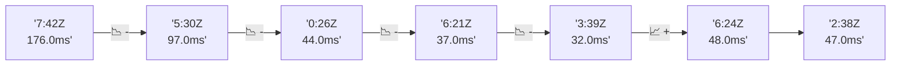

# 📊 Reporte de Performance - PokeAPI

**Fecha de corrida:** 2026-09-16 17:22 UTC

**Enlace:** [35127456874](https://github.com/rba3/Lab_CD_CI_Perfomance/actions/runs/35127456874)

## ✅ Veredicto

```
PASS (fallback por umbrales)

- Error maximo: 0.0%
- p95 maximo: 60.5 ms
```

## 🔮 Predicciones

⚠️ **Tendencia de degradación detectada** (LOW risk)
- Pendiente: +0.75ms/corrida
- P95 actual: 45.0ms
- Días hasta WARN: ~1006
- Días hasta FAIL: ~1940
- Confianza: 80%

## 📈 Métricas Globales

| Métrica | Valor | SLO | Estado |
|---------|-------|-----|--------|
| Error Rate | 0.0% | < 0.1% | ✅ PASS |
| Latencia p50 | 25.0ms | - | ℹ️ |
| Latencia p95 | 45.0ms | < 800ms | ✅ PASS |
| Latencia p99 | 61.0ms | - | ℹ️ |
| Throughput | 0.00 req/s | - | ℹ️ |
| Muestras | 0 | - | ℹ️ |

## 📉 Tendencia Histórica (Últimas 7 corridas)



## 🔧 Análisis Técnico Detallado (JSON)

```json
{
  "predictions": {
    "prediction": "DEGRADATION_TREND",
    "confidence": 80,
    "slope_ms_per_run": 0.75,
    "current_p95": 45.0,
    "days_to_warn": 1006,
    "days_to_fail": 1940,
    "risk_level": "LOW"
  },
  "recommendations": [],
  "correlations": {},
  "root_cause": {
    "issue": null,
    "root_cause": null,
    "confidence": 0,
    "evidence": []
  },
  "timestamp": "2026-09-16T17:22:09.149775"
}
```

## 📦 Datos Completos (JSON)

```json
{
  "scenario": "load",
  "overall": {
    "samples": 16137,
    "errors": 0,
    "error_pct": 0.0,
    "avg_ms": 25.8,
    "min_ms": 7,
    "max_ms": 207,
    "p50_ms": 25.0,
    "p90_ms": 40.0,
    "p95_ms": 45.0,
    "p99_ms": 61.0,
    "throughput_rps": 134.86,
    "duration_s": 119.7
  },
  "by_endpoint": {
    "ability-static": {
      "samples": 1613,
      "errors": 0,
      "error_pct": 0.0,
      "avg_ms": 25.3,
      "min_ms": 7,
      "max_ms": 119,
      "p50_ms": 25.0,
      "p90_ms": 39.0,
      "p95_ms": 42.0,
      "p99_ms": 54.0,
      "throughput_rps": 13.62,
      "duration_s": 118.4
    },
    "berry-cheri": {
      "samples": 1613,
      "errors": 0,
      "error_pct": 0.0,
      "avg_ms": 24.7,
      "min_ms": 7,
      "max_ms": 88,
      "p50_ms": 25.0,
      "p90_ms": 38.0,
      "p95_ms": 41.0,
      "p99_ms": 48.9,
      "throughput_rps": 13.63,
      "duration_s": 118.3
    },
    "generation-1": {
      "samples": 1613,
      "errors": 0,
      "error_pct": 0.0,
      "avg_ms": 24.9,
      "min_ms": 7,
      "max_ms": 96,
      "p50_ms": 25.0,
      "p90_ms": 39.0,
      "p95_ms": 42.0,
      "p99_ms": 52.0,
      "throughput_rps": 13.66,
      "duration_s": 118.1
    },
    "move-tackle": {
      "samples": 1614,
      "errors": 0,
      "error_pct": 0.0,
      "avg_ms": 25.9,
      "min_ms": 7,
      "max_ms": 127,
      "p50_ms": 27.0,
      "p90_ms": 40.0,
      "p95_ms": 43.0,
      "p99_ms": 53.7,
      "throughput_rps": 13.66,
      "duration_s": 118.2
    },
    "pokemon-charizard": {
      "samples": 1614,
      "errors": 0,
      "error_pct": 0.0,
      "avg_ms": 30.3,
      "min_ms": 8,
      "max_ms": 207,
      "p50_ms": 27.0,
      "p90_ms": 54.0,
      "p95_ms": 58.0,
      "p99_ms": 87.9,
      "throughput_rps": 13.55,
      "duration_s": 119.1
    },
    "pokemon-ditto": {
      "samples": 1614,
      "errors": 0,
      "error_pct": 0.0,
      "avg_ms": 24.6,
      "min_ms": 7,
      "max_ms": 199,
      "p50_ms": 23.5,
      "p90_ms": 39.0,
      "p95_ms": 41.0,
      "p99_ms": 50.9,
      "throughput_rps": 13.49,
      "duration_s": 119.6
    },
    "pokemon-list": {
      "samples": 1614,
      "errors": 0,
      "error_pct": 0.0,
      "avg_ms": 23.3,
      "min_ms": 7,
      "max_ms": 187,
      "p50_ms": 22.0,
      "p90_ms": 36.0,
      "p95_ms": 40.0,
      "p99_ms": 47.9,
      "throughput_rps": 13.59,
      "duration_s": 118.8
    },
    "pokemon-pikachu": {
      "samples": 1614,
      "errors": 0,
      "error_pct": 0.0,
      "avg_ms": 29.6,
      "min_ms": 8,
      "max_ms": 162,
      "p50_ms": 26.0,
      "p90_ms": 52.0,
      "p95_ms": 56.0,
      "p99_ms": 83.9,
      "throughput_rps": 13.55,
      "duration_s": 119.1
    },
    "type-fire": {
      "samples": 1614,
      "errors": 0,
      "error_pct": 0.0,
      "avg_ms": 24.7,
      "min_ms": 7,
      "max_ms": 87,
      "p50_ms": 24.0,
      "p90_ms": 38.0,
      "p95_ms": 41.0,
      "p99_ms": 50.0,
      "throughput_rps": 13.62,
      "duration_s": 118.5
    },
    "type-water": {
      "samples": 1614,
      "errors": 0,
      "error_pct": 0.0,
      "avg_ms": 24.2,
      "min_ms": 7,
      "max_ms": 88,
      "p50_ms": 24.0,
      "p90_ms": 36.0,
      "p95_ms": 40.3,
      "p99_ms": 47.0,
      "throughput_rps": 13.6,
      "duration_s": 118.7
    }
  },
  "empty": false
}
```

---

*Reporte generado automáticamente por el workflow de performance.*

*Timestamp: 2026-09-16T17:22:09.150857Z*
