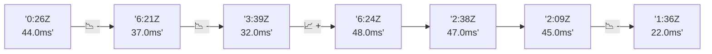

# 📊 Reporte de Performance - PokeAPI

**Fecha de corrida:** 2026-09-18 16:48 UTC

**Enlace:** [35370326785](https://github.com/rba3/Lab_CD_CI_Perfomance/actions/runs/35370326785)

## ✅ Veredicto

```
PASS (fallback por umbrales)

- Error maximo: 0.01%
- p95 maximo: 117.0 ms
```

## 🔮 Predicciones

✓ STABLE

## 📈 Métricas Globales

| Métrica | Valor | SLO | Estado |
|---------|-------|-----|--------|
| Error Rate | 0.01% | < 0.1% | ✅ PASS |
| Latencia p50 | 29.0ms | - | ℹ️ |
| Latencia p95 | 45.0ms | < 800ms | ✅ PASS |
| Latencia p99 | 68.0ms | - | ℹ️ |
| Throughput | 0.00 req/s | - | ℹ️ |
| Muestras | 0 | - | ℹ️ |

## 📉 Tendencia Histórica (Últimas 7 corridas)



## 🔧 Análisis Técnico Detallado (JSON)

```json
{
  "predictions": {
    "prediction": "STABLE",
    "confidence": 0,
    "slope_ms_per_run": -2.5,
    "current_p95": 45.0,
    "days_to_warn": null,
    "days_to_fail": null,
    "risk_level": "LOW"
  },
  "recommendations": [],
  "correlations": {},
  "root_cause": {
    "issue": null,
    "root_cause": null,
    "confidence": 0,
    "evidence": []
  },
  "timestamp": "2026-09-18T16:48:07.014043"
}
```

## 📦 Datos Completos (JSON)

```json
{
  "scenario": "load",
  "overall": {
    "samples": 15889,
    "errors": 1,
    "error_pct": 0.01,
    "avg_ms": 30.9,
    "min_ms": 16,
    "max_ms": 224,
    "p50_ms": 29.0,
    "p90_ms": 40.0,
    "p95_ms": 45.0,
    "p99_ms": 68.0,
    "throughput_rps": 132.77,
    "duration_s": 119.7
  },
  "by_endpoint": {
    "ability-static": {
      "samples": 1589,
      "errors": 0,
      "error_pct": 0.0,
      "avg_ms": 29.8,
      "min_ms": 16,
      "max_ms": 115,
      "p50_ms": 27.0,
      "p90_ms": 39.0,
      "p95_ms": 41.0,
      "p99_ms": 51.1,
      "throughput_rps": 13.42,
      "duration_s": 118.4
    },
    "berry-cheri": {
      "samples": 1589,
      "errors": 0,
      "error_pct": 0.0,
      "avg_ms": 29.5,
      "min_ms": 17,
      "max_ms": 91,
      "p50_ms": 29.0,
      "p90_ms": 38.0,
      "p95_ms": 41.0,
      "p99_ms": 52.4,
      "throughput_rps": 13.43,
      "duration_s": 118.3
    },
    "generation-1": {
      "samples": 1588,
      "errors": 0,
      "error_pct": 0.0,
      "avg_ms": 30.2,
      "min_ms": 18,
      "max_ms": 115,
      "p50_ms": 27.0,
      "p90_ms": 40.0,
      "p95_ms": 42.0,
      "p99_ms": 56.9,
      "throughput_rps": 13.45,
      "duration_s": 118.1
    },
    "move-tackle": {
      "samples": 1589,
      "errors": 0,
      "error_pct": 0.0,
      "avg_ms": 30.8,
      "min_ms": 17,
      "max_ms": 114,
      "p50_ms": 28.0,
      "p90_ms": 41.0,
      "p95_ms": 43.0,
      "p99_ms": 50.1,
      "throughput_rps": 13.45,
      "duration_s": 118.2
    },
    "pokemon-charizard": {
      "samples": 1589,
      "errors": 0,
      "error_pct": 0.0,
      "avg_ms": 38.1,
      "min_ms": 22,
      "max_ms": 224,
      "p50_ms": 34.0,
      "p90_ms": 51.0,
      "p95_ms": 61.0,
      "p99_ms": 119.5,
      "throughput_rps": 13.34,
      "duration_s": 119.1
    },
    "pokemon-ditto": {
      "samples": 1589,
      "errors": 0,
      "error_pct": 0.0,
      "avg_ms": 29.5,
      "min_ms": 16,
      "max_ms": 184,
      "p50_ms": 26.0,
      "p90_ms": 39.0,
      "p95_ms": 42.0,
      "p99_ms": 48.1,
      "throughput_rps": 13.28,
      "duration_s": 119.6
    },
    "pokemon-list": {
      "samples": 1589,
      "errors": 0,
      "error_pct": 0.0,
      "avg_ms": 27.3,
      "min_ms": 18,
      "max_ms": 111,
      "p50_ms": 25.0,
      "p90_ms": 37.0,
      "p95_ms": 40.0,
      "p99_ms": 48.0,
      "throughput_rps": 13.38,
      "duration_s": 118.8
    },
    "pokemon-pikachu": {
      "samples": 1589,
      "errors": 1,
      "error_pct": 0.06,
      "avg_ms": 35.3,
      "min_ms": 20,
      "max_ms": 190,
      "p50_ms": 31.0,
      "p90_ms": 49.0,
      "p95_ms": 54.0,
      "p99_ms": 94.4,
      "throughput_rps": 13.34,
      "duration_s": 119.1
    },
    "type-fire": {
      "samples": 1589,
      "errors": 0,
      "error_pct": 0.0,
      "avg_ms": 29.6,
      "min_ms": 18,
      "max_ms": 114,
      "p50_ms": 27.0,
      "p90_ms": 39.0,
      "p95_ms": 41.0,
      "p99_ms": 50.1,
      "throughput_rps": 13.41,
      "duration_s": 118.5
    },
    "type-water": {
      "samples": 1589,
      "errors": 0,
      "error_pct": 0.0,
      "avg_ms": 28.6,
      "min_ms": 17,
      "max_ms": 173,
      "p50_ms": 26.0,
      "p90_ms": 38.0,
      "p95_ms": 41.0,
      "p99_ms": 47.0,
      "throughput_rps": 13.39,
      "duration_s": 118.6
    }
  },
  "empty": false
}
```

---

*Reporte generado automáticamente por el workflow de performance.*

*Timestamp: 2026-09-18T16:48:07.014879Z*
