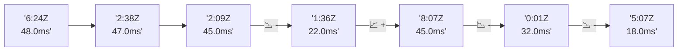

# 📊 Reporte de Performance - PokeAPI

**Fecha de corrida:** 2026-09-21 18:23 UTC

**Enlace:** [35637752594](https://github.com/rba3/Lab_CD_CI_Perfomance/actions/runs/35637752594)

## ✅ Veredicto

```
PASS (fallback por umbrales)

- Error maximo: 0.0%
- p95 maximo: 44.4 ms
```

## 🔮 Predicciones

✓ STABLE

## 📈 Métricas Globales

| Métrica | Valor | SLO | Estado |
|---------|-------|-----|--------|
| Error Rate | 0.0% | < 0.1% | ✅ PASS |
| Latencia p50 | 21.0ms | - | ℹ️ |
| Latencia p95 | 39.0ms | < 800ms | ✅ PASS |
| Latencia p99 | 54.0ms | - | ℹ️ |
| Throughput | 0.00 req/s | - | ℹ️ |
| Muestras | 0 | - | ℹ️ |

## 📉 Tendencia Histórica (Últimas 7 corridas)



## 🔧 Análisis Técnico Detallado (JSON)

```json
{
  "predictions": {
    "prediction": "STABLE",
    "confidence": 0,
    "slope_ms_per_run": -6.75,
    "current_p95": 39.0,
    "days_to_warn": null,
    "days_to_fail": null,
    "risk_level": "LOW"
  },
  "recommendations": [],
  "correlations": {},
  "root_cause": {
    "issue": null,
    "root_cause": null,
    "confidence": 0,
    "evidence": []
  },
  "timestamp": "2026-09-21T18:23:19.250435"
}
```

## 📦 Datos Completos (JSON)

```json
{
  "scenario": "load",
  "overall": {
    "samples": 16316,
    "errors": 0,
    "error_pct": 0.0,
    "avg_ms": 22.0,
    "min_ms": 6,
    "max_ms": 3711,
    "p50_ms": 21.0,
    "p90_ms": 34.0,
    "p95_ms": 39.0,
    "p99_ms": 54.0,
    "throughput_rps": 136.39,
    "duration_s": 119.6
  },
  "by_endpoint": {
    "ability-static": {
      "samples": 1632,
      "errors": 0,
      "error_pct": 0.0,
      "avg_ms": 21.0,
      "min_ms": 7,
      "max_ms": 103,
      "p50_ms": 21.0,
      "p90_ms": 32.0,
      "p95_ms": 35.0,
      "p99_ms": 51.7,
      "throughput_rps": 13.78,
      "duration_s": 118.4
    },
    "berry-cheri": {
      "samples": 1632,
      "errors": 0,
      "error_pct": 0.0,
      "avg_ms": 21.4,
      "min_ms": 6,
      "max_ms": 335,
      "p50_ms": 20.0,
      "p90_ms": 33.0,
      "p95_ms": 37.0,
      "p99_ms": 45.0,
      "throughput_rps": 13.79,
      "duration_s": 118.3
    },
    "generation-1": {
      "samples": 1631,
      "errors": 0,
      "error_pct": 0.0,
      "avg_ms": 21.6,
      "min_ms": 7,
      "max_ms": 95,
      "p50_ms": 21.0,
      "p90_ms": 34.0,
      "p95_ms": 38.0,
      "p99_ms": 47.0,
      "throughput_rps": 13.82,
      "duration_s": 118.0
    },
    "move-tackle": {
      "samples": 1631,
      "errors": 0,
      "error_pct": 0.0,
      "avg_ms": 21.2,
      "min_ms": 7,
      "max_ms": 100,
      "p50_ms": 21.0,
      "p90_ms": 33.0,
      "p95_ms": 37.0,
      "p99_ms": 45.0,
      "throughput_rps": 13.81,
      "duration_s": 118.1
    },
    "pokemon-charizard": {
      "samples": 1632,
      "errors": 0,
      "error_pct": 0.0,
      "avg_ms": 25.7,
      "min_ms": 8,
      "max_ms": 163,
      "p50_ms": 23.0,
      "p90_ms": 42.0,
      "p95_ms": 49.0,
      "p99_ms": 68.4,
      "throughput_rps": 13.71,
      "duration_s": 119.0
    },
    "pokemon-ditto": {
      "samples": 1632,
      "errors": 0,
      "error_pct": 0.0,
      "avg_ms": 23.1,
      "min_ms": 6,
      "max_ms": 3711,
      "p50_ms": 19.0,
      "p90_ms": 33.0,
      "p95_ms": 36.4,
      "p99_ms": 49.0,
      "throughput_rps": 13.65,
      "duration_s": 119.6
    },
    "pokemon-list": {
      "samples": 1632,
      "errors": 0,
      "error_pct": 0.0,
      "avg_ms": 19.9,
      "min_ms": 7,
      "max_ms": 121,
      "p50_ms": 19.0,
      "p90_ms": 31.0,
      "p95_ms": 35.0,
      "p99_ms": 42.7,
      "throughput_rps": 13.74,
      "duration_s": 118.8
    },
    "pokemon-pikachu": {
      "samples": 1632,
      "errors": 0,
      "error_pct": 0.0,
      "avg_ms": 24.3,
      "min_ms": 8,
      "max_ms": 154,
      "p50_ms": 21.0,
      "p90_ms": 41.0,
      "p95_ms": 47.0,
      "p99_ms": 68.1,
      "throughput_rps": 13.71,
      "duration_s": 119.1
    },
    "type-fire": {
      "samples": 1631,
      "errors": 0,
      "error_pct": 0.0,
      "avg_ms": 21.4,
      "min_ms": 7,
      "max_ms": 196,
      "p50_ms": 21.0,
      "p90_ms": 31.0,
      "p95_ms": 35.0,
      "p99_ms": 43.7,
      "throughput_rps": 13.77,
      "duration_s": 118.4
    },
    "type-water": {
      "samples": 1631,
      "errors": 0,
      "error_pct": 0.0,
      "avg_ms": 20.8,
      "min_ms": 7,
      "max_ms": 279,
      "p50_ms": 20.0,
      "p90_ms": 31.0,
      "p95_ms": 35.0,
      "p99_ms": 44.0,
      "throughput_rps": 13.75,
      "duration_s": 118.6
    }
  },
  "empty": false
}
```

---

*Reporte generado automáticamente por el workflow de performance.*

*Timestamp: 2026-09-21T18:23:19.251848Z*
