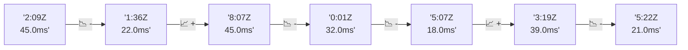

# 📊 Reporte de Performance - PokeAPI

**Fecha de corrida:** 2026-09-23 17:33 UTC

**Enlace:** [35896130125](https://github.com/rba3/Lab_CD_CI_Perfomance/actions/runs/35896130125)

## ✅ Veredicto

```
PASS (fallback por umbrales)

- Error maximo: 0.0%
- p95 maximo: 84.0 ms
```

## 🔮 Predicciones

✓ STABLE

## 📈 Métricas Globales

| Métrica | Valor | SLO | Estado |
|---------|-------|-----|--------|
| Error Rate | 0.0% | < 0.1% | ✅ PASS |
| Latencia p50 | 42.0ms | - | ℹ️ |
| Latencia p95 | 59.0ms | < 800ms | ✅ PASS |
| Latencia p99 | 91.0ms | - | ℹ️ |
| Throughput | 0.00 req/s | - | ℹ️ |
| Muestras | 0 | - | ℹ️ |

## 📉 Tendencia Histórica (Últimas 7 corridas)



## 🔧 Análisis Técnico Detallado (JSON)

```json
{
  "predictions": {
    "prediction": "STABLE",
    "confidence": 0,
    "slope_ms_per_run": -6.0,
    "current_p95": 59.0,
    "days_to_warn": null,
    "days_to_fail": null,
    "risk_level": "LOW"
  },
  "recommendations": [],
  "correlations": {},
  "root_cause": {
    "issue": null,
    "root_cause": null,
    "confidence": 0,
    "evidence": []
  },
  "timestamp": "2026-09-23T17:33:42.733761"
}
```

## 📦 Datos Completos (JSON)

```json
{
  "scenario": "load",
  "overall": {
    "samples": 15420,
    "errors": 0,
    "error_pct": 0.0,
    "avg_ms": 40.8,
    "min_ms": 21,
    "max_ms": 1405,
    "p50_ms": 42.0,
    "p90_ms": 54.0,
    "p95_ms": 59.0,
    "p99_ms": 91.0,
    "throughput_rps": 128.86,
    "duration_s": 119.7
  },
  "by_endpoint": {
    "ability-static": {
      "samples": 1541,
      "errors": 0,
      "error_pct": 0.0,
      "avg_ms": 39.7,
      "min_ms": 23,
      "max_ms": 176,
      "p50_ms": 42.0,
      "p90_ms": 45.0,
      "p95_ms": 47.0,
      "p99_ms": 64.0,
      "throughput_rps": 13.02,
      "duration_s": 118.4
    },
    "berry-cheri": {
      "samples": 1541,
      "errors": 0,
      "error_pct": 0.0,
      "avg_ms": 38.5,
      "min_ms": 21,
      "max_ms": 131,
      "p50_ms": 41.0,
      "p90_ms": 44.0,
      "p95_ms": 45.0,
      "p99_ms": 53.6,
      "throughput_rps": 13.04,
      "duration_s": 118.1
    },
    "generation-1": {
      "samples": 1542,
      "errors": 0,
      "error_pct": 0.0,
      "avg_ms": 39.1,
      "min_ms": 22,
      "max_ms": 130,
      "p50_ms": 42.0,
      "p90_ms": 45.0,
      "p95_ms": 47.0,
      "p99_ms": 53.0,
      "throughput_rps": 13.06,
      "duration_s": 118.1
    },
    "move-tackle": {
      "samples": 1542,
      "errors": 0,
      "error_pct": 0.0,
      "avg_ms": 40.7,
      "min_ms": 22,
      "max_ms": 153,
      "p50_ms": 43.0,
      "p90_ms": 47.0,
      "p95_ms": 50.0,
      "p99_ms": 58.8,
      "throughput_rps": 13.06,
      "duration_s": 118.1
    },
    "pokemon-charizard": {
      "samples": 1542,
      "errors": 0,
      "error_pct": 0.0,
      "avg_ms": 50.4,
      "min_ms": 28,
      "max_ms": 341,
      "p50_ms": 53.0,
      "p90_ms": 63.0,
      "p95_ms": 81.0,
      "p99_ms": 136.6,
      "throughput_rps": 12.95,
      "duration_s": 119.1
    },
    "pokemon-ditto": {
      "samples": 1543,
      "errors": 0,
      "error_pct": 0.0,
      "avg_ms": 38.6,
      "min_ms": 22,
      "max_ms": 212,
      "p50_ms": 42.0,
      "p90_ms": 45.0,
      "p95_ms": 47.0,
      "p99_ms": 57.6,
      "throughput_rps": 12.9,
      "duration_s": 119.7
    },
    "pokemon-list": {
      "samples": 1543,
      "errors": 0,
      "error_pct": 0.0,
      "avg_ms": 36.7,
      "min_ms": 21,
      "max_ms": 1405,
      "p50_ms": 40.0,
      "p90_ms": 43.0,
      "p95_ms": 45.0,
      "p99_ms": 51.6,
      "throughput_rps": 12.99,
      "duration_s": 118.8
    },
    "pokemon-pikachu": {
      "samples": 1542,
      "errors": 0,
      "error_pct": 0.0,
      "avg_ms": 47.2,
      "min_ms": 27,
      "max_ms": 240,
      "p50_ms": 41.0,
      "p90_ms": 59.0,
      "p95_ms": 78.9,
      "p99_ms": 147.5,
      "throughput_rps": 12.95,
      "duration_s": 119.1
    },
    "type-fire": {
      "samples": 1542,
      "errors": 0,
      "error_pct": 0.0,
      "avg_ms": 39.1,
      "min_ms": 21,
      "max_ms": 129,
      "p50_ms": 42.0,
      "p90_ms": 45.0,
      "p95_ms": 47.0,
      "p99_ms": 56.6,
      "throughput_rps": 13.01,
      "duration_s": 118.5
    },
    "type-water": {
      "samples": 1542,
      "errors": 0,
      "error_pct": 0.0,
      "avg_ms": 38.2,
      "min_ms": 22,
      "max_ms": 131,
      "p50_ms": 42.0,
      "p90_ms": 45.0,
      "p95_ms": 46.0,
      "p99_ms": 59.2,
      "throughput_rps": 13.01,
      "duration_s": 118.5
    }
  },
  "empty": false
}
```

---

*Reporte generado automáticamente por el workflow de performance.*

*Timestamp: 2026-09-23T17:33:42.734642Z*
