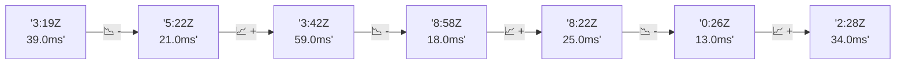

# 📊 Reporte de Performance - PokeAPI

**Fecha de corrida:** 2026-09-28 19:55 UTC

**Enlace:** [36475192594](https://github.com/rba3/Lab_CD_CI_Perfomance/actions/runs/36475192594)

## ✅ Veredicto

```
PASS (fallback por umbrales)

- Error maximo: 0.0%
- p95 maximo: 36.0 ms
```

## 🔮 Predicciones

✓ STABLE

## 📈 Métricas Globales

| Métrica | Valor | SLO | Estado |
|---------|-------|-----|--------|
| Error Rate | 0.0% | < 0.1% | ✅ PASS |
| Latencia p50 | 19.0ms | - | ℹ️ |
| Latencia p95 | 36.0ms | < 800ms | ✅ PASS |
| Latencia p99 | 382.0ms | - | ℹ️ |
| Throughput | 0.00 req/s | - | ℹ️ |
| Muestras | 0 | - | ℹ️ |

## 📉 Tendencia Histórica (Últimas 7 corridas)



## 🔧 Análisis Técnico Detallado (JSON)

```json
{
  "predictions": {
    "prediction": "STABLE",
    "confidence": 0,
    "slope_ms_per_run": -6.25,
    "current_p95": 36.0,
    "days_to_warn": null,
    "days_to_fail": null,
    "risk_level": "LOW"
  },
  "recommendations": [],
  "correlations": {},
  "root_cause": {
    "issue": null,
    "root_cause": null,
    "confidence": 0,
    "evidence": []
  },
  "timestamp": "2026-09-28T19:55:00.083192"
}
```

## 📦 Datos Completos (JSON)

```json
{
  "scenario": "load",
  "overall": {
    "samples": 15508,
    "errors": 0,
    "error_pct": 0.0,
    "avg_ms": 39.6,
    "min_ms": 6,
    "max_ms": 21601,
    "p50_ms": 19.0,
    "p90_ms": 30.0,
    "p95_ms": 36.0,
    "p99_ms": 382.0,
    "throughput_rps": 122.14,
    "duration_s": 127.0
  },
  "by_endpoint": {
    "ability-static": {
      "samples": 1550,
      "errors": 0,
      "error_pct": 0.0,
      "avg_ms": 32.3,
      "min_ms": 7,
      "max_ms": 6568,
      "p50_ms": 18.0,
      "p90_ms": 27.0,
      "p95_ms": 32.0,
      "p99_ms": 327.2,
      "throughput_rps": 13.1,
      "duration_s": 118.3
    },
    "berry-cheri": {
      "samples": 1551,
      "errors": 0,
      "error_pct": 0.0,
      "avg_ms": 30.4,
      "min_ms": 6,
      "max_ms": 4143,
      "p50_ms": 18.0,
      "p90_ms": 27.0,
      "p95_ms": 34.5,
      "p99_ms": 309.0,
      "throughput_rps": 13.13,
      "duration_s": 118.2
    },
    "generation-1": {
      "samples": 1550,
      "errors": 0,
      "error_pct": 0.0,
      "avg_ms": 35.0,
      "min_ms": 7,
      "max_ms": 9542,
      "p50_ms": 20.0,
      "p90_ms": 30.0,
      "p95_ms": 37.0,
      "p99_ms": 329.0,
      "throughput_rps": 13.15,
      "duration_s": 117.9
    },
    "move-tackle": {
      "samples": 1550,
      "errors": 0,
      "error_pct": 0.0,
      "avg_ms": 46.7,
      "min_ms": 7,
      "max_ms": 11972,
      "p50_ms": 18.0,
      "p90_ms": 27.0,
      "p95_ms": 32.5,
      "p99_ms": 379.3,
      "throughput_rps": 12.36,
      "duration_s": 125.4
    },
    "pokemon-charizard": {
      "samples": 1552,
      "errors": 0,
      "error_pct": 0.0,
      "avg_ms": 56.5,
      "min_ms": 8,
      "max_ms": 5635,
      "p50_ms": 23.0,
      "p90_ms": 36.0,
      "p95_ms": 49.0,
      "p99_ms": 896.2,
      "throughput_rps": 13.05,
      "duration_s": 118.9
    },
    "pokemon-ditto": {
      "samples": 1551,
      "errors": 0,
      "error_pct": 0.0,
      "avg_ms": 29.9,
      "min_ms": 7,
      "max_ms": 4135,
      "p50_ms": 18.0,
      "p90_ms": 27.0,
      "p95_ms": 30.0,
      "p99_ms": 401.0,
      "throughput_rps": 12.97,
      "duration_s": 119.6
    },
    "pokemon-list": {
      "samples": 1551,
      "errors": 0,
      "error_pct": 0.0,
      "avg_ms": 27.0,
      "min_ms": 7,
      "max_ms": 2611,
      "p50_ms": 18.0,
      "p90_ms": 26.0,
      "p95_ms": 32.0,
      "p99_ms": 148.0,
      "throughput_rps": 13.07,
      "duration_s": 118.7
    },
    "pokemon-pikachu": {
      "samples": 1551,
      "errors": 0,
      "error_pct": 0.0,
      "avg_ms": 54.2,
      "min_ms": 8,
      "max_ms": 11373,
      "p50_ms": 22.0,
      "p90_ms": 33.0,
      "p95_ms": 39.0,
      "p99_ms": 559.5,
      "throughput_rps": 13.03,
      "duration_s": 119.1
    },
    "type-fire": {
      "samples": 1551,
      "errors": 0,
      "error_pct": 0.0,
      "avg_ms": 40.9,
      "min_ms": 7,
      "max_ms": 21601,
      "p50_ms": 18.0,
      "p90_ms": 28.0,
      "p95_ms": 34.0,
      "p99_ms": 233.5,
      "throughput_rps": 13.1,
      "duration_s": 118.4
    },
    "type-water": {
      "samples": 1551,
      "errors": 0,
      "error_pct": 0.0,
      "avg_ms": 43.4,
      "min_ms": 7,
      "max_ms": 6243,
      "p50_ms": 18.0,
      "p90_ms": 27.0,
      "p95_ms": 33.0,
      "p99_ms": 572.0,
      "throughput_rps": 12.91,
      "duration_s": 120.1
    }
  },
  "empty": false
}
```

---

*Reporte generado automáticamente por el workflow de performance.*

*Timestamp: 2026-09-28T19:55:00.084617Z*
