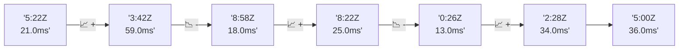

# 📊 Reporte de Performance - PokeAPI

**Fecha de corrida:** 2026-09-29 18:23 UTC

**Enlace:** [36611358211](https://github.com/rba3/Lab_CD_CI_Perfomance/actions/runs/36611358211)

## ✅ Veredicto

```
PASS (fallback por umbrales)

- Error maximo: 0.02%
- p95 maximo: 162.2 ms
```

## 🔮 Predicciones

⚠️ **Tendencia de degradación detectada** (LOW risk)
- Pendiente: +4.5ms/corrida
- P95 actual: 149.0ms
- Días hasta WARN: ~144
- Días hasta FAIL: ~300
- Confianza: 80%

## 📈 Métricas Globales

| Métrica | Valor | SLO | Estado |
|---------|-------|-----|--------|
| Error Rate | 0.02% | < 0.1% | ✅ PASS |
| Latencia p50 | 62.0ms | - | ℹ️ |
| Latencia p95 | 149.0ms | < 800ms | ✅ PASS |
| Latencia p99 | 195.1ms | - | ℹ️ |
| Throughput | 0.00 req/s | - | ℹ️ |
| Muestras | 0 | - | ℹ️ |

## 📉 Tendencia Histórica (Últimas 7 corridas)



## 🔧 Análisis Técnico Detallado (JSON)

```json
{
  "predictions": {
    "prediction": "DEGRADATION_TREND",
    "confidence": 80,
    "slope_ms_per_run": 4.5,
    "current_p95": 149.0,
    "days_to_warn": 144,
    "days_to_fail": 300,
    "risk_level": "LOW"
  },
  "recommendations": [],
  "correlations": {},
  "root_cause": {
    "issue": null,
    "root_cause": null,
    "confidence": 0,
    "evidence": []
  },
  "timestamp": "2026-09-29T18:23:19.144731"
}
```

## 📦 Datos Completos (JSON)

```json
{
  "scenario": "load",
  "overall": {
    "samples": 14195,
    "errors": 3,
    "error_pct": 0.02,
    "avg_ms": 70.4,
    "min_ms": 1,
    "max_ms": 696,
    "p50_ms": 62.0,
    "p90_ms": 127.0,
    "p95_ms": 149.0,
    "p99_ms": 195.1,
    "throughput_rps": 118.58,
    "duration_s": 119.7
  },
  "by_endpoint": {
    "ability-static": {
      "samples": 1419,
      "errors": 1,
      "error_pct": 0.07,
      "avg_ms": 62.2,
      "min_ms": 8,
      "max_ms": 356,
      "p50_ms": 31.0,
      "p90_ms": 116.0,
      "p95_ms": 117.0,
      "p99_ms": 123.8,
      "throughput_rps": 12.04,
      "duration_s": 117.9
    },
    "berry-cheri": {
      "samples": 1420,
      "errors": 1,
      "error_pct": 0.07,
      "avg_ms": 60.4,
      "min_ms": 1,
      "max_ms": 339,
      "p50_ms": 31.0,
      "p90_ms": 111.0,
      "p95_ms": 113.0,
      "p99_ms": 120.0,
      "throughput_rps": 12.04,
      "duration_s": 117.9
    },
    "generation-1": {
      "samples": 1418,
      "errors": 0,
      "error_pct": 0.0,
      "avg_ms": 64.1,
      "min_ms": 12,
      "max_ms": 348,
      "p50_ms": 49.0,
      "p90_ms": 114.0,
      "p95_ms": 116.0,
      "p99_ms": 125.8,
      "throughput_rps": 12.05,
      "duration_s": 117.7
    },
    "move-tackle": {
      "samples": 1420,
      "errors": 0,
      "error_pct": 0.0,
      "avg_ms": 65.8,
      "min_ms": 11,
      "max_ms": 360,
      "p50_ms": 35.0,
      "p90_ms": 119.0,
      "p95_ms": 122.0,
      "p99_ms": 135.4,
      "throughput_rps": 12.05,
      "duration_s": 117.9
    },
    "pokemon-charizard": {
      "samples": 1420,
      "errors": 0,
      "error_pct": 0.0,
      "avg_ms": 100.8,
      "min_ms": 16,
      "max_ms": 696,
      "p50_ms": 127.0,
      "p90_ms": 169.0,
      "p95_ms": 182.0,
      "p99_ms": 389.0,
      "throughput_rps": 11.95,
      "duration_s": 118.8
    },
    "pokemon-ditto": {
      "samples": 1419,
      "errors": 0,
      "error_pct": 0.0,
      "avg_ms": 66.2,
      "min_ms": 11,
      "max_ms": 488,
      "p50_ms": 90.0,
      "p90_ms": 117.0,
      "p95_ms": 120.0,
      "p99_ms": 128.0,
      "throughput_rps": 11.86,
      "duration_s": 119.6
    },
    "pokemon-list": {
      "samples": 1420,
      "errors": 0,
      "error_pct": 0.0,
      "avg_ms": 64.0,
      "min_ms": 12,
      "max_ms": 336,
      "p50_ms": 86.0,
      "p90_ms": 112.0,
      "p95_ms": 114.0,
      "p99_ms": 124.6,
      "throughput_rps": 11.98,
      "duration_s": 118.5
    },
    "pokemon-pikachu": {
      "samples": 1420,
      "errors": 0,
      "error_pct": 0.0,
      "avg_ms": 91.1,
      "min_ms": 13,
      "max_ms": 610,
      "p50_ms": 118.5,
      "p90_ms": 157.0,
      "p95_ms": 162.0,
      "p99_ms": 311.1,
      "throughput_rps": 11.91,
      "duration_s": 119.2
    },
    "type-fire": {
      "samples": 1419,
      "errors": 1,
      "error_pct": 0.07,
      "avg_ms": 65.0,
      "min_ms": 8,
      "max_ms": 346,
      "p50_ms": 88.0,
      "p90_ms": 115.0,
      "p95_ms": 117.0,
      "p99_ms": 123.0,
      "throughput_rps": 12.01,
      "duration_s": 118.2
    },
    "type-water": {
      "samples": 1420,
      "errors": 0,
      "error_pct": 0.0,
      "avg_ms": 64.7,
      "min_ms": 12,
      "max_ms": 347,
      "p50_ms": 35.0,
      "p90_ms": 116.0,
      "p95_ms": 118.0,
      "p99_ms": 128.0,
      "throughput_rps": 12.01,
      "duration_s": 118.2
    }
  },
  "empty": false
}
```

---

*Reporte generado automáticamente por el workflow de performance.*

*Timestamp: 2026-09-29T18:23:19.146199Z*
