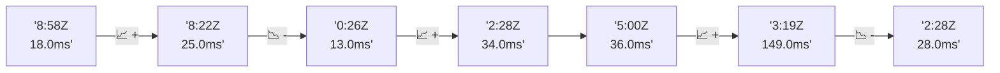

# 📊 Reporte de Performance - PokeAPI

**Fecha de corrida:** 2026-10-01 18:38 UTC

**Enlace:** [36907986156](https://github.com/rba3/Lab_CD_CI_Perfomance/actions/runs/36907986156)

## ✅ Veredicto

```
PASS (fallback por umbrales)

- Error maximo: 0.0%
- p95 maximo: 31.2 ms
```

## 🔮 Predicciones

⚠️ **Tendencia de degradación detectada** (LOW risk)
- Pendiente: +3.75ms/corrida
- P95 actual: 27.0ms
- Días hasta WARN: ~206
- Días hasta FAIL: ~392
- Confianza: 80%

## 📈 Métricas Globales

| Métrica | Valor | SLO | Estado |
|---------|-------|-----|--------|
| Error Rate | 0.0% | < 0.1% | ✅ PASS |
| Latencia p50 | 18.0ms | - | ℹ️ |
| Latencia p95 | 27.0ms | < 800ms | ✅ PASS |
| Latencia p99 | 42.0ms | - | ℹ️ |
| Throughput | 0.00 req/s | - | ℹ️ |
| Muestras | 0 | - | ℹ️ |

## 📉 Tendencia Histórica (Últimas 7 corridas)



## 🔧 Análisis Técnico Detallado (JSON)

```json
{
  "predictions": {
    "prediction": "DEGRADATION_TREND",
    "confidence": 80,
    "slope_ms_per_run": 3.75,
    "current_p95": 27.0,
    "days_to_warn": 206,
    "days_to_fail": 392,
    "risk_level": "LOW"
  },
  "recommendations": [],
  "correlations": {},
  "root_cause": {
    "issue": null,
    "root_cause": null,
    "confidence": 0,
    "evidence": []
  },
  "timestamp": "2026-10-01T18:38:26.534199"
}
```

## 📦 Datos Completos (JSON)

```json
{
  "scenario": "load",
  "overall": {
    "samples": 16450,
    "errors": 0,
    "error_pct": 0.0,
    "avg_ms": 19.3,
    "min_ms": 13,
    "max_ms": 270,
    "p50_ms": 18.0,
    "p90_ms": 24.0,
    "p95_ms": 27.0,
    "p99_ms": 42.0,
    "throughput_rps": 137.53,
    "duration_s": 119.6
  },
  "by_endpoint": {
    "ability-static": {
      "samples": 1645,
      "errors": 0,
      "error_pct": 0.0,
      "avg_ms": 18.8,
      "min_ms": 13,
      "max_ms": 65,
      "p50_ms": 18.0,
      "p90_ms": 23.0,
      "p95_ms": 26.0,
      "p99_ms": 40.6,
      "throughput_rps": 13.9,
      "duration_s": 118.3
    },
    "berry-cheri": {
      "samples": 1645,
      "errors": 0,
      "error_pct": 0.0,
      "avg_ms": 18.3,
      "min_ms": 13,
      "max_ms": 97,
      "p50_ms": 17.0,
      "p90_ms": 22.0,
      "p95_ms": 25.0,
      "p99_ms": 40.6,
      "throughput_rps": 13.9,
      "duration_s": 118.3
    },
    "generation-1": {
      "samples": 1645,
      "errors": 0,
      "error_pct": 0.0,
      "avg_ms": 18.9,
      "min_ms": 13,
      "max_ms": 151,
      "p50_ms": 17.0,
      "p90_ms": 23.0,
      "p95_ms": 26.0,
      "p99_ms": 44.6,
      "throughput_rps": 13.94,
      "duration_s": 118.0
    },
    "move-tackle": {
      "samples": 1645,
      "errors": 0,
      "error_pct": 0.0,
      "avg_ms": 19.2,
      "min_ms": 14,
      "max_ms": 108,
      "p50_ms": 18.0,
      "p90_ms": 23.0,
      "p95_ms": 26.0,
      "p99_ms": 37.6,
      "throughput_rps": 13.93,
      "duration_s": 118.1
    },
    "pokemon-charizard": {
      "samples": 1645,
      "errors": 0,
      "error_pct": 0.0,
      "avg_ms": 22.5,
      "min_ms": 17,
      "max_ms": 177,
      "p50_ms": 21.0,
      "p90_ms": 27.0,
      "p95_ms": 33.0,
      "p99_ms": 49.0,
      "throughput_rps": 13.82,
      "duration_s": 119.0
    },
    "pokemon-ditto": {
      "samples": 1645,
      "errors": 0,
      "error_pct": 0.0,
      "avg_ms": 19.2,
      "min_ms": 14,
      "max_ms": 270,
      "p50_ms": 18.0,
      "p90_ms": 23.0,
      "p95_ms": 26.0,
      "p99_ms": 41.6,
      "throughput_rps": 13.76,
      "duration_s": 119.6
    },
    "pokemon-list": {
      "samples": 1645,
      "errors": 0,
      "error_pct": 0.0,
      "avg_ms": 17.2,
      "min_ms": 13,
      "max_ms": 131,
      "p50_ms": 16.0,
      "p90_ms": 20.0,
      "p95_ms": 22.0,
      "p99_ms": 37.6,
      "throughput_rps": 13.86,
      "duration_s": 118.7
    },
    "pokemon-pikachu": {
      "samples": 1645,
      "errors": 0,
      "error_pct": 0.0,
      "avg_ms": 22.2,
      "min_ms": 16,
      "max_ms": 84,
      "p50_ms": 20.0,
      "p90_ms": 27.0,
      "p95_ms": 33.0,
      "p99_ms": 63.6,
      "throughput_rps": 13.82,
      "duration_s": 119.0
    },
    "type-fire": {
      "samples": 1645,
      "errors": 0,
      "error_pct": 0.0,
      "avg_ms": 18.2,
      "min_ms": 13,
      "max_ms": 63,
      "p50_ms": 17.0,
      "p90_ms": 22.0,
      "p95_ms": 24.0,
      "p99_ms": 36.6,
      "throughput_rps": 13.89,
      "duration_s": 118.5
    },
    "type-water": {
      "samples": 1645,
      "errors": 0,
      "error_pct": 0.0,
      "avg_ms": 19.0,
      "min_ms": 13,
      "max_ms": 107,
      "p50_ms": 18.0,
      "p90_ms": 23.0,
      "p95_ms": 25.8,
      "p99_ms": 33.6,
      "throughput_rps": 13.86,
      "duration_s": 118.7
    }
  },
  "empty": false
}
```

---

*Reporte generado automáticamente por el workflow de performance.*

*Timestamp: 2026-10-01T18:38:26.535097Z*
