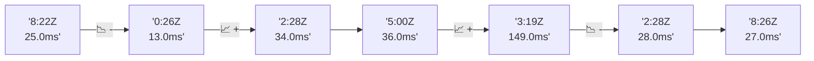

# 📊 Reporte de Performance - PokeAPI

**Fecha de corrida:** 2026-10-02 18:07 UTC

**Enlace:** [37045030806](https://github.com/rba3/Lab_CD_CI_Perfomance/actions/runs/37045030806)

## ✅ Veredicto

```
PASS (fallback por umbrales)

- Error maximo: 0.0%
- p95 maximo: 58.0 ms
```

## 🔮 Predicciones

✓ STABLE

## 📈 Métricas Globales

| Métrica | Valor | SLO | Estado |
|---------|-------|-----|--------|
| Error Rate | 0.0% | < 0.1% | ✅ PASS |
| Latencia p50 | 27.0ms | - | ℹ️ |
| Latencia p95 | 39.0ms | < 800ms | ✅ PASS |
| Latencia p99 | 62.0ms | - | ℹ️ |
| Throughput | 0.00 req/s | - | ℹ️ |
| Muestras | 0 | - | ℹ️ |

## 📉 Tendencia Histórica (Últimas 7 corridas)



## 🔧 Análisis Técnico Detallado (JSON)

```json
{
  "predictions": {
    "prediction": "STABLE",
    "confidence": 0,
    "slope_ms_per_run": -1.75,
    "current_p95": 39.0,
    "days_to_warn": null,
    "days_to_fail": null,
    "risk_level": "LOW"
  },
  "recommendations": [],
  "correlations": {},
  "root_cause": {
    "issue": null,
    "root_cause": null,
    "confidence": 0,
    "evidence": []
  },
  "timestamp": "2026-10-02T18:07:39.549898"
}
```

## 📦 Datos Completos (JSON)

```json
{
  "scenario": "load",
  "overall": {
    "samples": 15984,
    "errors": 0,
    "error_pct": 0.0,
    "avg_ms": 28.7,
    "min_ms": 18,
    "max_ms": 275,
    "p50_ms": 27.0,
    "p90_ms": 35.0,
    "p95_ms": 39.0,
    "p99_ms": 62.0,
    "throughput_rps": 133.62,
    "duration_s": 119.6
  },
  "by_endpoint": {
    "ability-static": {
      "samples": 1599,
      "errors": 0,
      "error_pct": 0.0,
      "avg_ms": 28.4,
      "min_ms": 18,
      "max_ms": 114,
      "p50_ms": 27.0,
      "p90_ms": 35.0,
      "p95_ms": 39.0,
      "p99_ms": 57.0,
      "throughput_rps": 13.51,
      "duration_s": 118.3
    },
    "berry-cheri": {
      "samples": 1599,
      "errors": 0,
      "error_pct": 0.0,
      "avg_ms": 27.1,
      "min_ms": 18,
      "max_ms": 103,
      "p50_ms": 26.0,
      "p90_ms": 32.0,
      "p95_ms": 37.0,
      "p99_ms": 55.0,
      "throughput_rps": 13.51,
      "duration_s": 118.3
    },
    "generation-1": {
      "samples": 1598,
      "errors": 0,
      "error_pct": 0.0,
      "avg_ms": 28.3,
      "min_ms": 18,
      "max_ms": 82,
      "p50_ms": 27.0,
      "p90_ms": 35.0,
      "p95_ms": 39.0,
      "p99_ms": 57.0,
      "throughput_rps": 13.55,
      "duration_s": 118.0
    },
    "move-tackle": {
      "samples": 1598,
      "errors": 0,
      "error_pct": 0.0,
      "avg_ms": 27.7,
      "min_ms": 19,
      "max_ms": 101,
      "p50_ms": 27.0,
      "p90_ms": 33.0,
      "p95_ms": 36.0,
      "p99_ms": 50.0,
      "throughput_rps": 13.53,
      "duration_s": 118.1
    },
    "pokemon-charizard": {
      "samples": 1598,
      "errors": 0,
      "error_pct": 0.0,
      "avg_ms": 34.7,
      "min_ms": 23,
      "max_ms": 147,
      "p50_ms": 32.0,
      "p90_ms": 42.0,
      "p95_ms": 49.1,
      "p99_ms": 78.1,
      "throughput_rps": 13.43,
      "duration_s": 118.9
    },
    "pokemon-ditto": {
      "samples": 1599,
      "errors": 0,
      "error_pct": 0.0,
      "avg_ms": 27.8,
      "min_ms": 19,
      "max_ms": 275,
      "p50_ms": 27.0,
      "p90_ms": 33.0,
      "p95_ms": 37.0,
      "p99_ms": 56.0,
      "throughput_rps": 13.37,
      "duration_s": 119.6
    },
    "pokemon-list": {
      "samples": 1599,
      "errors": 0,
      "error_pct": 0.0,
      "avg_ms": 26.8,
      "min_ms": 18,
      "max_ms": 235,
      "p50_ms": 25.0,
      "p90_ms": 32.0,
      "p95_ms": 36.0,
      "p99_ms": 48.0,
      "throughput_rps": 13.48,
      "duration_s": 118.7
    },
    "pokemon-pikachu": {
      "samples": 1598,
      "errors": 0,
      "error_pct": 0.0,
      "avg_ms": 32.2,
      "min_ms": 23,
      "max_ms": 132,
      "p50_ms": 30.0,
      "p90_ms": 38.0,
      "p95_ms": 46.1,
      "p99_ms": 72.1,
      "throughput_rps": 13.43,
      "duration_s": 119.0
    },
    "type-fire": {
      "samples": 1598,
      "errors": 0,
      "error_pct": 0.0,
      "avg_ms": 27.4,
      "min_ms": 20,
      "max_ms": 98,
      "p50_ms": 26.0,
      "p90_ms": 33.0,
      "p95_ms": 36.0,
      "p99_ms": 55.1,
      "throughput_rps": 13.49,
      "duration_s": 118.4
    },
    "type-water": {
      "samples": 1598,
      "errors": 0,
      "error_pct": 0.0,
      "avg_ms": 26.8,
      "min_ms": 19,
      "max_ms": 84,
      "p50_ms": 26.0,
      "p90_ms": 32.0,
      "p95_ms": 35.0,
      "p99_ms": 48.0,
      "throughput_rps": 13.48,
      "duration_s": 118.6
    }
  },
  "empty": false
}
```

---

*Reporte generado automáticamente por el workflow de performance.*

*Timestamp: 2026-10-02T18:07:39.551277Z*
