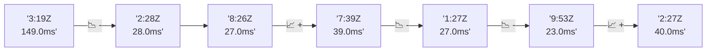

# 📊 Reporte de Performance - PokeAPI

**Fecha de corrida:** 2026-10-07 19:09 UTC

**Enlace:** [37671913609](https://github.com/rba3/Lab_CD_CI_Perfomance/actions/runs/37671913609)

## ✅ Veredicto

```
PASS (fallback por umbrales)

- Error maximo: 0.01%
- p95 maximo: 61.8 ms
```

## 🔮 Predicciones

⚠️ **Tendencia de degradación detectada** (LOW risk)
- Pendiente: +3.25ms/corrida
- P95 actual: 55.0ms
- Días hasta WARN: ~229
- Días hasta FAIL: ~444
- Confianza: 80%

## 📈 Métricas Globales

| Métrica | Valor | SLO | Estado |
|---------|-------|-----|--------|
| Error Rate | 0.01% | < 0.1% | ✅ PASS |
| Latencia p50 | 40.0ms | - | ℹ️ |
| Latencia p95 | 55.0ms | < 800ms | ✅ PASS |
| Latencia p99 | 96.8ms | - | ℹ️ |
| Throughput | 0.00 req/s | - | ℹ️ |
| Muestras | 0 | - | ℹ️ |

## 📉 Tendencia Histórica (Últimas 7 corridas)



## 🔧 Análisis Técnico Detallado (JSON)

```json
{
  "predictions": {
    "prediction": "DEGRADATION_TREND",
    "confidence": 80,
    "slope_ms_per_run": 3.25,
    "current_p95": 55.0,
    "days_to_warn": 229,
    "days_to_fail": 444,
    "risk_level": "LOW"
  },
  "recommendations": [],
  "correlations": {},
  "root_cause": {
    "issue": null,
    "root_cause": null,
    "confidence": 0,
    "evidence": []
  },
  "timestamp": "2026-10-07T19:09:02.916916"
}
```

## 📦 Datos Completos (JSON)

```json
{
  "scenario": "load",
  "overall": {
    "samples": 15422,
    "errors": 1,
    "error_pct": 0.01,
    "avg_ms": 40.7,
    "min_ms": 2,
    "max_ms": 766,
    "p50_ms": 40.0,
    "p90_ms": 49.0,
    "p95_ms": 55.0,
    "p99_ms": 96.8,
    "throughput_rps": 128.86,
    "duration_s": 119.7
  },
  "by_endpoint": {
    "ability-static": {
      "samples": 1542,
      "errors": 0,
      "error_pct": 0.0,
      "avg_ms": 39.0,
      "min_ms": 29,
      "max_ms": 180,
      "p50_ms": 39.0,
      "p90_ms": 45.0,
      "p95_ms": 48.0,
      "p99_ms": 71.5,
      "throughput_rps": 13.03,
      "duration_s": 118.3
    },
    "berry-cheri": {
      "samples": 1542,
      "errors": 0,
      "error_pct": 0.0,
      "avg_ms": 38.7,
      "min_ms": 29,
      "max_ms": 766,
      "p50_ms": 38.0,
      "p90_ms": 44.0,
      "p95_ms": 47.0,
      "p99_ms": 58.2,
      "throughput_rps": 13.05,
      "duration_s": 118.2
    },
    "generation-1": {
      "samples": 1542,
      "errors": 0,
      "error_pct": 0.0,
      "avg_ms": 38.4,
      "min_ms": 29,
      "max_ms": 130,
      "p50_ms": 39.0,
      "p90_ms": 46.9,
      "p95_ms": 49.0,
      "p99_ms": 56.6,
      "throughput_rps": 13.06,
      "duration_s": 118.1
    },
    "move-tackle": {
      "samples": 1543,
      "errors": 0,
      "error_pct": 0.0,
      "avg_ms": 40.6,
      "min_ms": 30,
      "max_ms": 293,
      "p50_ms": 40.0,
      "p90_ms": 48.0,
      "p95_ms": 51.0,
      "p99_ms": 86.4,
      "throughput_rps": 13.07,
      "duration_s": 118.1
    },
    "pokemon-charizard": {
      "samples": 1542,
      "errors": 0,
      "error_pct": 0.0,
      "avg_ms": 50.5,
      "min_ms": 38,
      "max_ms": 447,
      "p50_ms": 45.0,
      "p90_ms": 61.0,
      "p95_ms": 69.0,
      "p99_ms": 140.0,
      "throughput_rps": 12.95,
      "duration_s": 119.0
    },
    "pokemon-ditto": {
      "samples": 1542,
      "errors": 1,
      "error_pct": 0.06,
      "avg_ms": 39.2,
      "min_ms": 2,
      "max_ms": 362,
      "p50_ms": 36.0,
      "p90_ms": 48.0,
      "p95_ms": 51.0,
      "p99_ms": 78.8,
      "throughput_rps": 12.9,
      "duration_s": 119.6
    },
    "pokemon-list": {
      "samples": 1542,
      "errors": 0,
      "error_pct": 0.0,
      "avg_ms": 35.3,
      "min_ms": 28,
      "max_ms": 124,
      "p50_ms": 33.0,
      "p90_ms": 42.0,
      "p95_ms": 45.0,
      "p99_ms": 53.0,
      "throughput_rps": 13.0,
      "duration_s": 118.6
    },
    "pokemon-pikachu": {
      "samples": 1543,
      "errors": 0,
      "error_pct": 0.0,
      "avg_ms": 48.1,
      "min_ms": 37,
      "max_ms": 235,
      "p50_ms": 42.0,
      "p90_ms": 59.0,
      "p95_ms": 79.8,
      "p99_ms": 145.6,
      "throughput_rps": 12.95,
      "duration_s": 119.1
    },
    "type-fire": {
      "samples": 1542,
      "errors": 0,
      "error_pct": 0.0,
      "avg_ms": 38.8,
      "min_ms": 28,
      "max_ms": 244,
      "p50_ms": 38.5,
      "p90_ms": 45.0,
      "p95_ms": 49.0,
      "p99_ms": 88.0,
      "throughput_rps": 13.02,
      "duration_s": 118.4
    },
    "type-water": {
      "samples": 1542,
      "errors": 0,
      "error_pct": 0.0,
      "avg_ms": 38.4,
      "min_ms": 29,
      "max_ms": 329,
      "p50_ms": 37.0,
      "p90_ms": 45.0,
      "p95_ms": 48.0,
      "p99_ms": 68.5,
      "throughput_rps": 13.02,
      "duration_s": 118.5
    }
  },
  "empty": false
}
```

---

*Reporte generado automáticamente por el workflow de performance.*

*Timestamp: 2026-10-07T19:09:02.918317Z*
