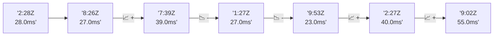

# 📊 Reporte de Performance - PokeAPI

**Fecha de corrida:** 2026-10-08 19:05 UTC

**Enlace:** [37828888039](https://github.com/rba3/Lab_CD_CI_Perfomance/actions/runs/37828888039)

## ✅ Veredicto

```
PASS (fallback por umbrales)

- Error maximo: 0.0%
- p95 maximo: 71.5 ms
```

## 🔮 Predicciones

⚠️ **Tendencia de degradación detectada** (LOW risk)
- Pendiente: +4.0ms/corrida
- P95 actual: 58.0ms
- Días hasta WARN: ~185
- Días hasta FAIL: ~360
- Confianza: 80%

## 📈 Métricas Globales

| Métrica | Valor | SLO | Estado |
|---------|-------|-----|--------|
| Error Rate | 0.0% | < 0.1% | ✅ PASS |
| Latencia p50 | 22.0ms | - | ℹ️ |
| Latencia p95 | 58.0ms | < 800ms | ✅ PASS |
| Latencia p99 | 84.0ms | - | ℹ️ |
| Throughput | 0.00 req/s | - | ℹ️ |
| Muestras | 0 | - | ℹ️ |

## 📉 Tendencia Histórica (Últimas 7 corridas)



## 🔧 Análisis Técnico Detallado (JSON)

```json
{
  "predictions": {
    "prediction": "DEGRADATION_TREND",
    "confidence": 80,
    "slope_ms_per_run": 4.0,
    "current_p95": 58.0,
    "days_to_warn": 185,
    "days_to_fail": 360,
    "risk_level": "LOW"
  },
  "recommendations": [],
  "correlations": {},
  "root_cause": {
    "issue": null,
    "root_cause": null,
    "confidence": 0,
    "evidence": []
  },
  "timestamp": "2026-10-08T19:05:01.141842"
}
```

## 📦 Datos Completos (JSON)

```json
{
  "scenario": "load",
  "overall": {
    "samples": 15951,
    "errors": 0,
    "error_pct": 0.0,
    "avg_ms": 29.4,
    "min_ms": 14,
    "max_ms": 486,
    "p50_ms": 22.0,
    "p90_ms": 49.0,
    "p95_ms": 58.0,
    "p99_ms": 84.0,
    "throughput_rps": 133.3,
    "duration_s": 119.7
  },
  "by_endpoint": {
    "ability-static": {
      "samples": 1595,
      "errors": 0,
      "error_pct": 0.0,
      "avg_ms": 28.5,
      "min_ms": 14,
      "max_ms": 485,
      "p50_ms": 22.0,
      "p90_ms": 47.0,
      "p95_ms": 50.0,
      "p99_ms": 59.0,
      "throughput_rps": 13.47,
      "duration_s": 118.4
    },
    "berry-cheri": {
      "samples": 1595,
      "errors": 0,
      "error_pct": 0.0,
      "avg_ms": 27.1,
      "min_ms": 14,
      "max_ms": 155,
      "p50_ms": 20.0,
      "p90_ms": 47.0,
      "p95_ms": 50.0,
      "p99_ms": 63.1,
      "throughput_rps": 13.47,
      "duration_s": 118.4
    },
    "generation-1": {
      "samples": 1595,
      "errors": 0,
      "error_pct": 0.0,
      "avg_ms": 27.5,
      "min_ms": 14,
      "max_ms": 199,
      "p50_ms": 20.0,
      "p90_ms": 49.0,
      "p95_ms": 52.0,
      "p99_ms": 65.0,
      "throughput_rps": 13.51,
      "duration_s": 118.0
    },
    "move-tackle": {
      "samples": 1595,
      "errors": 0,
      "error_pct": 0.0,
      "avg_ms": 29.7,
      "min_ms": 14,
      "max_ms": 225,
      "p50_ms": 22.0,
      "p90_ms": 50.0,
      "p95_ms": 53.0,
      "p99_ms": 66.2,
      "throughput_rps": 13.51,
      "duration_s": 118.1
    },
    "pokemon-charizard": {
      "samples": 1596,
      "errors": 0,
      "error_pct": 0.0,
      "avg_ms": 34.5,
      "min_ms": 18,
      "max_ms": 251,
      "p50_ms": 25.0,
      "p90_ms": 63.0,
      "p95_ms": 70.2,
      "p99_ms": 120.0,
      "throughput_rps": 13.4,
      "duration_s": 119.1
    },
    "pokemon-ditto": {
      "samples": 1595,
      "errors": 0,
      "error_pct": 0.0,
      "avg_ms": 32.4,
      "min_ms": 15,
      "max_ms": 264,
      "p50_ms": 26.0,
      "p90_ms": 49.0,
      "p95_ms": 55.0,
      "p99_ms": 101.1,
      "throughput_rps": 13.34,
      "duration_s": 119.5
    },
    "pokemon-list": {
      "samples": 1595,
      "errors": 0,
      "error_pct": 0.0,
      "avg_ms": 24.9,
      "min_ms": 14,
      "max_ms": 84,
      "p50_ms": 19.0,
      "p90_ms": 44.0,
      "p95_ms": 46.0,
      "p99_ms": 51.0,
      "throughput_rps": 13.44,
      "duration_s": 118.7
    },
    "pokemon-pikachu": {
      "samples": 1595,
      "errors": 0,
      "error_pct": 0.0,
      "avg_ms": 34.9,
      "min_ms": 16,
      "max_ms": 486,
      "p50_ms": 23.0,
      "p90_ms": 60.0,
      "p95_ms": 67.3,
      "p99_ms": 153.5,
      "throughput_rps": 13.4,
      "duration_s": 119.0
    },
    "type-fire": {
      "samples": 1595,
      "errors": 0,
      "error_pct": 0.0,
      "avg_ms": 27.7,
      "min_ms": 14,
      "max_ms": 135,
      "p50_ms": 21.0,
      "p90_ms": 47.0,
      "p95_ms": 49.0,
      "p99_ms": 62.1,
      "throughput_rps": 13.47,
      "duration_s": 118.4
    },
    "type-water": {
      "samples": 1595,
      "errors": 0,
      "error_pct": 0.0,
      "avg_ms": 26.9,
      "min_ms": 14,
      "max_ms": 308,
      "p50_ms": 21.0,
      "p90_ms": 46.0,
      "p95_ms": 48.0,
      "p99_ms": 58.0,
      "throughput_rps": 13.44,
      "duration_s": 118.6
    }
  },
  "empty": false
}
```

---

*Reporte generado automáticamente por el workflow de performance.*

*Timestamp: 2026-10-08T19:05:01.142991Z*
