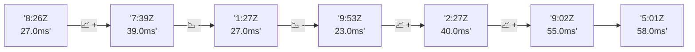

# 📊 Reporte de Performance - PokeAPI

**Fecha de corrida:** 2026-10-09 18:35 UTC

**Enlace:** [37974040080](https://github.com/rba3/Lab_CD_CI_Perfomance/actions/runs/37974040080)

## ✅ Veredicto

```
PASS (fallback por umbrales)

- Error maximo: 0.0%
- p95 maximo: 51.0 ms
```

## 🔮 Predicciones

⚠️ **Tendencia de degradación detectada** (LOW risk)
- Pendiente: +7.75ms/corrida
- P95 actual: 39.0ms
- Días hasta WARN: ~98
- Días hasta FAIL: ~188
- Confianza: 80%

## 📈 Métricas Globales

| Métrica | Valor | SLO | Estado |
|---------|-------|-----|--------|
| Error Rate | 0.0% | < 0.1% | ✅ PASS |
| Latencia p50 | 29.0ms | - | ℹ️ |
| Latencia p95 | 39.0ms | < 800ms | ✅ PASS |
| Latencia p99 | 69.0ms | - | ℹ️ |
| Throughput | 0.00 req/s | - | ℹ️ |
| Muestras | 0 | - | ℹ️ |

## 📉 Tendencia Histórica (Últimas 7 corridas)



## 🔧 Análisis Técnico Detallado (JSON)

```json
{
  "predictions": {
    "prediction": "DEGRADATION_TREND",
    "confidence": 80,
    "slope_ms_per_run": 7.75,
    "current_p95": 39.0,
    "days_to_warn": 98,
    "days_to_fail": 188,
    "risk_level": "LOW"
  },
  "recommendations": [],
  "correlations": {},
  "root_cause": {
    "issue": null,
    "root_cause": null,
    "confidence": 0,
    "evidence": []
  },
  "timestamp": "2026-10-09T18:35:38.031936"
}
```

## 📦 Datos Completos (JSON)

```json
{
  "scenario": "load",
  "overall": {
    "samples": 15900,
    "errors": 0,
    "error_pct": 0.0,
    "avg_ms": 30.4,
    "min_ms": 19,
    "max_ms": 303,
    "p50_ms": 29.0,
    "p90_ms": 36.0,
    "p95_ms": 39.0,
    "p99_ms": 69.0,
    "throughput_rps": 132.92,
    "duration_s": 119.6
  },
  "by_endpoint": {
    "ability-static": {
      "samples": 1590,
      "errors": 0,
      "error_pct": 0.0,
      "avg_ms": 29.1,
      "min_ms": 21,
      "max_ms": 110,
      "p50_ms": 28.0,
      "p90_ms": 35.1,
      "p95_ms": 37.0,
      "p99_ms": 41.0,
      "throughput_rps": 13.44,
      "duration_s": 118.3
    },
    "berry-cheri": {
      "samples": 1590,
      "errors": 0,
      "error_pct": 0.0,
      "avg_ms": 28.5,
      "min_ms": 19,
      "max_ms": 105,
      "p50_ms": 27.0,
      "p90_ms": 35.0,
      "p95_ms": 36.0,
      "p99_ms": 40.2,
      "throughput_rps": 13.45,
      "duration_s": 118.2
    },
    "generation-1": {
      "samples": 1589,
      "errors": 0,
      "error_pct": 0.0,
      "avg_ms": 29.2,
      "min_ms": 20,
      "max_ms": 173,
      "p50_ms": 28.0,
      "p90_ms": 36.0,
      "p95_ms": 37.0,
      "p99_ms": 40.0,
      "throughput_rps": 13.48,
      "duration_s": 117.9
    },
    "move-tackle": {
      "samples": 1589,
      "errors": 0,
      "error_pct": 0.0,
      "avg_ms": 29.9,
      "min_ms": 21,
      "max_ms": 113,
      "p50_ms": 28.0,
      "p90_ms": 37.0,
      "p95_ms": 38.0,
      "p99_ms": 45.0,
      "throughput_rps": 13.47,
      "duration_s": 118.0
    },
    "pokemon-charizard": {
      "samples": 1591,
      "errors": 0,
      "error_pct": 0.0,
      "avg_ms": 37.8,
      "min_ms": 26,
      "max_ms": 193,
      "p50_ms": 35.0,
      "p90_ms": 48.0,
      "p95_ms": 52.0,
      "p99_ms": 93.1,
      "throughput_rps": 13.37,
      "duration_s": 119.0
    },
    "pokemon-ditto": {
      "samples": 1590,
      "errors": 0,
      "error_pct": 0.0,
      "avg_ms": 29.9,
      "min_ms": 21,
      "max_ms": 303,
      "p50_ms": 28.0,
      "p90_ms": 37.0,
      "p95_ms": 38.0,
      "p99_ms": 46.0,
      "throughput_rps": 13.3,
      "duration_s": 119.5
    },
    "pokemon-list": {
      "samples": 1590,
      "errors": 0,
      "error_pct": 0.0,
      "avg_ms": 26.7,
      "min_ms": 20,
      "max_ms": 76,
      "p50_ms": 26.0,
      "p90_ms": 30.0,
      "p95_ms": 34.0,
      "p99_ms": 39.0,
      "throughput_rps": 13.41,
      "duration_s": 118.6
    },
    "pokemon-pikachu": {
      "samples": 1591,
      "errors": 0,
      "error_pct": 0.0,
      "avg_ms": 35.8,
      "min_ms": 26,
      "max_ms": 197,
      "p50_ms": 33.0,
      "p90_ms": 44.0,
      "p95_ms": 50.0,
      "p99_ms": 99.3,
      "throughput_rps": 13.36,
      "duration_s": 119.1
    },
    "type-fire": {
      "samples": 1590,
      "errors": 0,
      "error_pct": 0.0,
      "avg_ms": 29.1,
      "min_ms": 22,
      "max_ms": 111,
      "p50_ms": 28.0,
      "p90_ms": 35.0,
      "p95_ms": 37.0,
      "p99_ms": 47.2,
      "throughput_rps": 13.43,
      "duration_s": 118.4
    },
    "type-water": {
      "samples": 1590,
      "errors": 0,
      "error_pct": 0.0,
      "avg_ms": 27.9,
      "min_ms": 21,
      "max_ms": 94,
      "p50_ms": 27.0,
      "p90_ms": 33.0,
      "p95_ms": 36.0,
      "p99_ms": 41.0,
      "throughput_rps": 13.41,
      "duration_s": 118.5
    }
  },
  "empty": false
}
```

---

*Reporte generado automáticamente por el workflow de performance.*

*Timestamp: 2026-10-09T18:35:38.033341Z*
